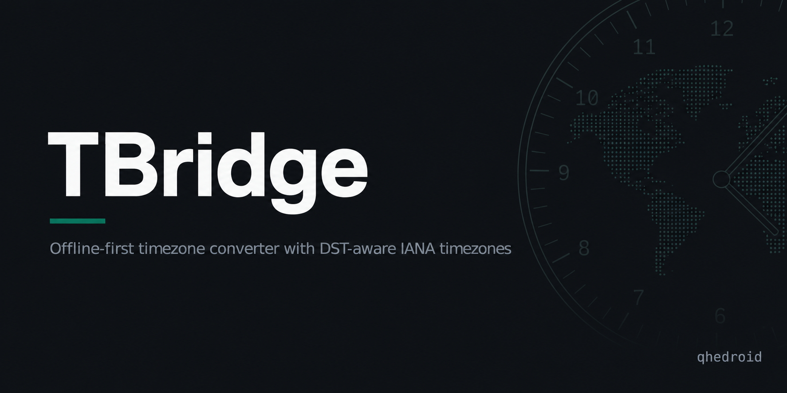

<div align="center">
  
</div>

<br>


TBridge is a small frontend-only timezone converter for comparing one source date and time across multiple destination cities. It uses IANA timezone IDs and Luxon for DST-aware conversion, with an offline city index for fast local search.


## Overview

The app is designed as a focused productivity utility: choose a source date, time, and timezone, add destination cities, then copy or share the resulting conversion. There is no backend, database, authentication, or runtime API.

## Features

- DST-aware timezone conversion using Luxon
- IANA timezone IDs as the source of truth
- Offline city search with all world capitals and selected major secondary cities
- Curated source timezone dropdown
- Multiple destination cities
- Source row plus compact result rows
- Previous/next day indicators
- 12h and 24h display modes
- Copy results as plain text
- Shareable URL state
- Responsive dark UI

## Tech Stack

| Tool | Purpose |
| --- | --- |
| Vite | Build tool and dev server |
| React | UI framework |
| TypeScript | Strict application types |
| Tailwind CSS | Styling |
| Luxon | Timezone conversion and formatting |
| Vitest | Unit tests |

## Architecture

TBridge is a static browser app.

- `src/data/timezones.ts` contains primary timezone options and search helpers.
- `src/data/sourceTimezones.ts` contains the curated source dropdown list.
- `src/data/cityIndex.ts` contains the offline city index used by destination search.
- `src/utils/conversion.ts` handles Luxon conversion and formatting.
- `src/hooks/useUrlState.ts` serializes app state into the URL.
- `src/components/` contains the UI.

All timezone calculations happen in the browser. The app does not manually calculate offsets.

## Offline City Index

The destination search uses a local city index rather than a runtime geocoding API. V1 includes all world capitals, selected major secondary cities, ranking metadata, aliases, and IANA timezone mappings.

Search prioritizes exact city matches, then starts-with matches, then broader matches. Capital and major city priorities help keep ambiguous results useful.

Future versions may generate the index from GeoNames or a similar open dataset.

## Running Locally

```bash
npm install
npm run dev
```

Open [http://localhost:5173](http://localhost:5173).

## Testing

```bash
npm test
```

The test suite covers core conversion behavior, city search resolution, source dropdown constraints, and important ranking cases.

## Production Build

```bash
npm run build
```

The static build is written to `dist/`.

## Roadmap

v1.0.0 is released and [live on Vercel](https://tbridge-pied.vercel.app). Post-release:

- Optional repeatable city index build pipeline
- Broader manual browser and mobile QA

## Case study

This project is documented with honest readiness signals (tests, docs, CI)
at [noel-q.dev](https://noel-q.dev/projects/timebridge).

---

<div align="center">
  <sub>noel-q · part of the <a href="https://www.linkedin.com/in/noelquadri2001">Noel Quadri</a> portfolio</sub>
</div>
